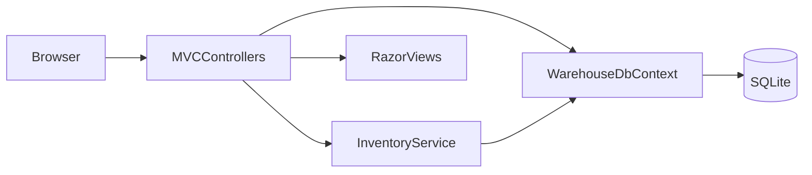

# Stockroom Lite

Stockroom Lite is a small application that controls warehouse inventory.

## What the application shows

- The application uses ASP.NET Core MVC and server-rendered Razor views.
- The C# code uses dependency injection, asynchronous operations, validation, and view models.
- EF Core controls the migrations and the normalized SQLite schema.
- Transactions update the inventory and an audit trail that users cannot change.
- Users can search, apply filters, and view dashboard reports.
- A responsive Bootstrap user interface shows the application data.
- xUnit integration tests use an in-memory SQLite database.

## Start the application

1. Install the [.NET 10 SDK](https://dotnet.microsoft.com/download/dotnet/10.0).
2. In the repository root, run this command:

```powershell
dotnet run --project src/CS_Warehouse.Web
```

3. Open the URL that the terminal shows.

The URL is usually `http://localhost:5261`.

At startup, the application applies its migration. It automatically creates the `stockroom-lite.db` database. The database contains categories and storage locations. It does not contain sample products.

## Reset the database

1. Stop the application.
2. Delete `src/CS_Warehouse.Web/stockroom-lite.db`.
3. Start the application.

At startup, the migration creates the database again.

## Main workflow

1. On the dashboard, review active SKUs, total units, and products that have low stock.
2. Add a product to the catalog.
3. Enter a unique SKU, category, cost, and reorder level for the product.
4. Record a receipt, stock issue, or physical-count adjustment at a storage location.
5. Open the product to see its location balances and stock movement history.
6. Filter the audit trail by product, location, movement type, or search text.

The application rejects a stock issue if the location balance would become negative. An adjustment records the difference between the stored balance and the physical count.

## Architecture



Controllers process HTTP requests and prepare view models. `InventoryService` contains the business rules that change stock. `WarehouseDbContext` maps the domain models to SQLite.


## Database design

- One `Category` can contain many `Product` records.
- `InventoryBalance` connects one `Product` to one `Location`.
- Each `StockMovement` refers to one product and one location.
- A composite primary key permits only one balance for each product and location pair.
- Unique indexes prevent duplicate category names, SKUs, and location codes.
- These indexes ignore differences between uppercase and lowercase letters.
- Database constraints prevent negative balances and stock movements with a zero change.

The application stores the current balance and a stock movement ledger. Users cannot change existing records in the ledger. Thus, the balance is easy to read, and the ledger identifies each change.

`InventoryService` updates the balance and ledger in one transaction. This transaction keeps the two records consistent during normal operation.

## Tests

Run this command:

```powershell
dotnet test CS_Warehouse.sln
```

The tests verify these functions:

- Stock receipts, issues, and adjustments.
- Creation of a location balance when it does not exist.
- Rollback when the available stock is insufficient.
- Prevention of duplicate SKUs.
- Calculation of dashboard totals.


